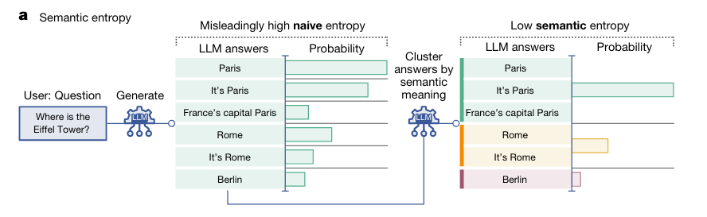
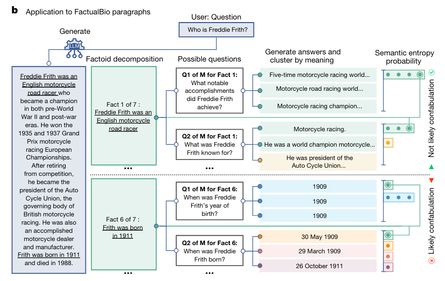

## Detecting hallucinations in large language models using semantic entropy

#### ℹ️基本信息

|                                                                                                                                                                                                                                                                                                                                                                                                                                                                                                                                                                                                                                                                                                                                                                                                                                                                                                                                                                                                                                                                                                                                                                                                                                                                                                                                                                                                                                                                                                                                                                                                                                                                                                                                                                                                                                                                                                                                                                                                                                                                                                                                                                                                                                                                                                                                                                                                                                                                                                                                                                                                                                                                                                                                                                                                                                                                                                                                                                                                                                                                                                                                                                                                                                                                                                                                                                                                                                                                                                                                                                                                                                                                                                                                                                                                                                                                                                                                                                                                                                                                                         |
| --------------------------------------------------------------------------------------------------------------------------------------------------------------------------------------------------------------------------------------------------------------------------------------------------------------------------------------------------------------------------------------------------------------------------------------------------------------------------------------------------------------------------------------------------------------------------------------------------------------------------------------------------------------------------------------------------------------------------------------------------------------------------------------------------------------------------------------------------------------------------------------------------------------------------------------------------------------------------------------------------------------------------------------------------------------------------------------------------------------------------------------------------------------------------------------------------------------------------------------------------------------------------------------------------------------------------------------------------------------------------------------------------------------------------------------------------------------------------------------------------------------------------------------------------------------------------------------------------------------------------------------------------------------------------------------------------------------------------------------------------------------------------------------------------------------------------------------------------------------------------------------------------------------------------------------------------------------------------------------------------------------------------------------------------------------------------------------------------------------------------------------------------------------------------------------------------------------------------------------------------------------------------------------------------------------------------------------------------------------------------------------------------------------------------------------------------------------------------------------------------------------------------------------------------------------------------------------------------------------------------------------------------------------------------------------------------------------------------------------------------------------------------------------------------------------------------------------------------------------------------------------------------------------------------------------------------------------------------------------------------------------------------------------------------------------------------------------------------------------------------------------------------------------------------------------------------------------------------------------------------------------------------------------------------------------------------------------------------------------------------------------------------------------------------------------------------------------------------------------------------------------------------------------------------------------------------------------------------------------------------------------------------------------------------------------------------------------------------------------------------------------------------------------------------------------------------------------------------------------------------------------------------------------------------------------------------------------------------------------------------------------------------------------------------------------------------------------- |
| **期刊: Nature**（发表年份: 2024）**作者:****机构: 牛津大学**                                                                                                                                                                                                                                                                                                                                                                                                                                                                                                                                                                                                                                                                                                                                                                                                                                                                                                                                                                                                                                                                                                                                                                                                                                                                                                                                                                                                                                                                                                                                                                                                                                                                                                                                                                                                                                                                                                                                                                                                                                                                                                                                                                                                                                                                                                                                                                                                                                                                                                                                                                                                                                                                                                                                                                                                                                                                                                                                                                                                                                                                                                                                                                                                                                                                                                                                                                                                                                                                                                                                                                                                                                                                                                                                                                                                                                                                                                                                                                                                                                           |
| **摘要:**<a href="zotero://open-pdf/library/items/CFBX43RB?page=1">“Large language model (LLM) systems, such as ChatGPT1 or Gemini2, can show impressive reasoning and question-answering capabilities but often ‘hallucinate’ false outputs and unsubstantiated answers3,4. Answering unreliably or without the necessary information prevents adoption in diverse fields, with problems including fabrication of legal precedents5 or untrue facts in news articles6 and even posing a risk to human life in medical domains such as radiology7. Encouraging truthfulness through supervision or reinforcement has been only partially successful8. Researchers need a general method for detecting hallucinations in LLMs that works even with new and unseen questions to which humans might not know the answer. Here we develop new methods grounded in statistics, proposing entropy-based uncertainty estimators for LLMs to detect a subset of hallucinations—confabulations—which are arbitrary and incorrect generations. Our method addresses the fact that one idea can be expressed in many ways by computing uncertainty at the level of meaning rather than specific sequences of words. Our method works across datasets and tasks without a priori knowledge of the task, requires no task-specific data and robustly generalizes to new tasks not seen before. By detecting when a prompt is likely to produce a confabulation, our method helps users understand when they must take extra care with LLMs and opens up new possibilities for using LLMs that are otherwise prevented by their unreliability.”</a> (<a href="zotero://select/library/items/QUKXKBXR">“Detecting hallucinations in large language models using semantic entropy | Nature”, p. 625</a>) |
| \*\*Local Link: \*\*[Detecting hallucinations in large language models .pdf](zotero://open-pdf/0_CFBX43RB)                                                                                                                                                                                                                                                                                                                                                                                                                                                                                                                                                                                                                                                                                                                                                                                                                                                                                                                                                                                                                                                                                                                                                                                                                                                                                                                                                                                                                                                                                                                                                                                                                                                                                                                                                                                                                                                                                                                                                                                                                                                                                                                                                                                                                                                                                                                                                                                                                                                                                                                                                                                                                                                                                                                                                                                                                                                                                                                                                                                                                                                                                                                                                                                                                                                                                                                                                                                                                                                                                                                                                                                                                                                                                                                                                                                                                                                                                                                                                                              |

#### 💡一、研究内容

大型语言模型（LLMs）在生成文本时出现的“幻觉”现象，即模型生成不合理或与给定信息不符的内容。研究如何利用语义熵作为一种工具来检测知识幻觉和提高LLM生成文本的可靠性。

#### 📜二、研究背景

大模型取得了令人印象深刻的效果，但依然存在知识幻觉----->

回答不可靠严重限制了LLMs在高严谨领域的应用--------->

监督学习、强化学习取得了一定的成功----------->

依然需要一种有效的方法检测幻觉，即使对于人类没见过或不知道答案的问题------->

为此提出了基于语义熵的不确定检测器，用于检测幻觉------------>

该方法相比之前克服了语义多样性的问题，且不需要先验知识。

#### 🔬三、主要方法

1、方法流程：

*   设置模型的推理生成参数（temperature，top-k），采样模型对问题的多个输出回答
*   将输出根据语义进行分类（根据是否相互语义蕴含分为一类，使用某种NLI模型完成）
*   根据语义类别计算语义不确定性（语义熵）

2、具体实例：

#### 🚩四、实验结果

#### 📌五、知识点

> \[!IMPORTANT]
>
> 大模型幻觉定义：大模型生成无意义或不忠于源内容的输出，LLMs generating “content that is nonsensical or unfaithful to the provided source content”
>
> 本篇文章针对模型幻觉中的虚构问题，提出了基于语义熵的检测方法（熵高意味着不确定性高，相比于传统的基于token的熵计算，语义熵能够克服语义多样性的问题）

#### 🔬六、思考
