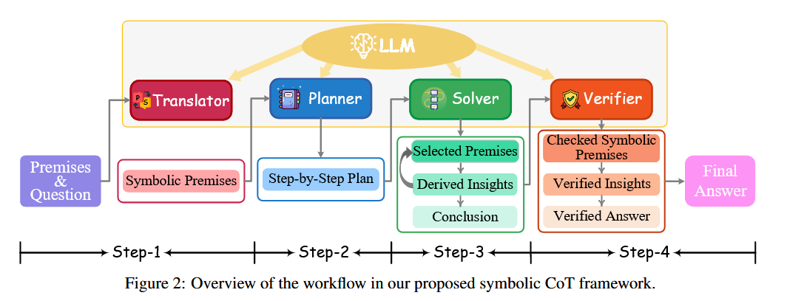
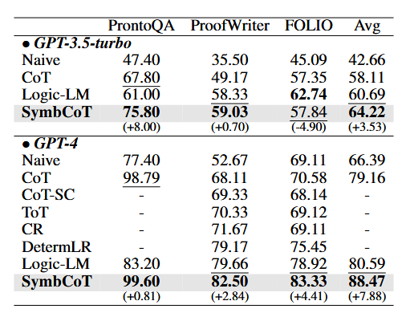

## Faithful Logical Reasoning via Symbolic Chain-of-Thought

#### ℹ️基本信息

|                                                                                                                                                                                                                                                                                                                                                                                                                                                                                                                                                                                                                                                                                                                                                                                                                                                                                                                                                                                                                                                                                                                                                                                                                                                                                                                                                                        |
| ---------------------------------------------------------------------------------------------------------------------------------------------------------------------------------------------------------------------------------------------------------------------------------------------------------------------------------------------------------------------------------------------------------------------------------------------------------------------------------------------------------------------------------------------------------------------------------------------------------------------------------------------------------------------------------------------------------------------------------------------------------------------------------------------------------------------------------------------------------------------------------------------------------------------------------------------------------------------------------------------------------------------------------------------------------------------------------------------------------------------------------------------------------------------------------------------------------------------------------------------------------------------------------------------------------------------------------------------------------------------- |
| **期刊: ACL**（发表年份:**2024**）**作者:**Jundong Xu; Hao Fei; Liangming Pan; Qian Liu; Mong-Li Lee; Wynne Hsu**机构: 新加坡国立大学**                                                                                                                                                                                                                                                                                                                                                                                                                                                                                                                                                                                                                                                                                                                                                                                                                                                                                                                                                                                                                                                                                                                                                                                                                                                   |
| \*\*摘要: \*\**While the recent Chain-of-Thought (CoT) technique enhances the reasoning ability of large language models (LLMs) with the theory of mind, it might still struggle in handling logical reasoning that relies much on symbolic expressions and rigid deducing rules. To strengthen the logical reasoning capability of LLMs, we propose a novel Symbolic Chain-of-Thought, namely SymbCoT, a fully LLM-based framework that integrates symbolic expressions and logic rules with CoT prompting. Technically, building upon an LLM, SymbCoT 1) first translates the natural language context into the symbolic format, and then 2) derives a step-by-step plan to solve the problem with symbolic logical rules, 3) followed by a verifier to check the translation and reasoning chain. Via thorough evaluations on 5 standard datasets with both First-Order Logic and Constraint Optimization symbolic expressions, SymbCoT shows striking improvements over the CoT method consistently, meanwhile refreshing the current state-of-the-art performances. We further demonstrate that our system advances in more faithful, flexible, and explainable logical reasoning. To our knowledge, this is the first to combine symbolic expressions and rules into CoT for logical reasoning with LLMs. Code is open at <https://github.com/Aiden0526/SymbCoT>.* |
| \*\*Local Link: \*\*[Xu 等 - 2024 - Faithful Logical Reasoning via Symbolic Chain-of-T.pdf](zotero://open-pdf/0_T7KQWSJU)                                                                                                                                                                                                                                                                                                                                                                                                                                                                                                                                                                                                                                                                                                                                                                                                                                                                                                                                                                                                                                                                                                                                                                                                                                               |

#### 💡一、研究内容

LLMs在处理具有逻辑推理时依然存在很大的困难，特别是对于需要符号表达式和严格规则的问题。为此，本工作旨在研究基于cot的符号推理增强方法，在不依靠外部工具的前提下，提高模型的推理表现。

#### 📜二、研究背景

逻辑推理是大模型的重要能力之一，在问题求解、决策指定等方面发挥着关键作用。它集中体现了以严格的证据评估、论证构建和逻辑演绎为特征的认知过程。目前，很多方法利用LLMs作为翻译器，将自然语言转化为符号化的逻辑表达式，并利用外部的solver进行求解。**但这样的方法本质上没有对大模型的本身能力进行增强，且过度依赖solver会导致灵活性差、信息缺失，难以解释等问题。** COT是一个不错的方法，但直接使用COT进行逻辑推理具有很大的局限性，为此本篇文章提出了SymCOT。

1.  首先，外部推理器需要严格的格式，LLM 的任何翻译错误都可能导致解析和推理失败。
2.  其次，整个推理过程由LLMs进行，提供基本原理，确保整个解释更加人性化。
3.  第三，我们提出在逻辑推理过程中融合符号形式和自然语言表达，实现精确的推理计算，同时充分解释自然语言固有的隐含信息。

#### 🔬三、主要方法

SymCOT的主要模块包括：翻译器，规划器，求解器，验证器。

推理过程：

1.  翻译器将自然语言文本符号化
2.  规划器将原始问题分解为小的子问题，从而制定详细的求解计划
3.  求解器严格的根据逻辑规则和求解步骤对问题进行求解
4.  验证器验证LLMs翻译的是否正确，以及模型求解的过程是否正确

#### 🚩四、实验结果

#### 📌五、知识点

#### 🔬六、思考

在这篇文章中主要强调了该方法是对大模型本身推理能力的提升（相比于引入外部求解器），并且该方法对于翻译时的信息缺失、信息错误具有更好的鲁棒性。
