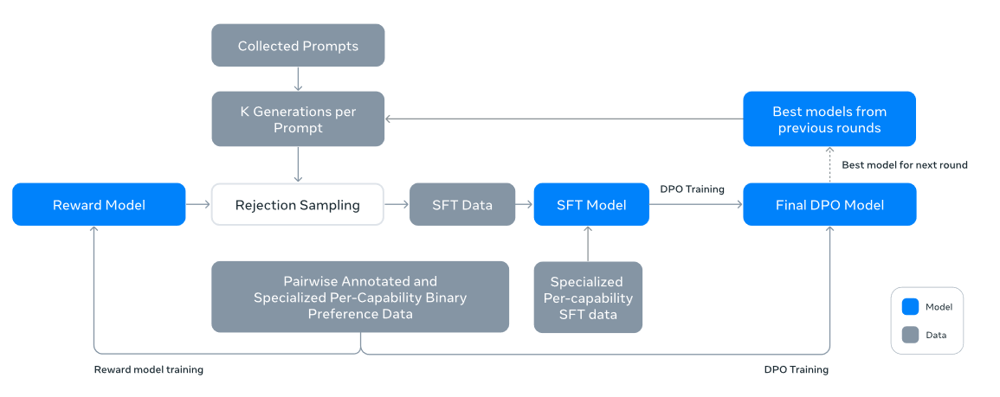
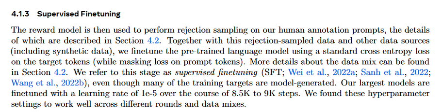

## Introducing Llama 3.1: Our most capable models to date

#### ℹ️基本信息

|                                                                                                                                                                                                                                                                                                                                                                                                                                                                                                                                                                                                                                                                                                                                                                                                                                                                                                                                                                                                                                                                                                                                 |
| ------------------------------------------------------------------------------------------------------------------------------------------------------------------------------------------------------------------------------------------------------------------------------------------------------------------------------------------------------------------------------------------------------------------------------------------------------------------------------------------------------------------------------------------------------------------------------------------------------------------------------------------------------------------------------------------------------------------------------------------------------------------------------------------------------------------------------------------------------------------------------------------------------------------------------------------------------------------------------------------------------------------------------------------------------------------------------------------------------------------------------- |
| **期刊:**（发表年份: 2024）\*\*机构:\*\*meta AI                                                                                                                                                                                                                                                                                                                                                                                                                                                                                                                                                                                                                                                                                                                                                                                                                                                                                                                                                                                                                                                                                           |
| \*\*摘要: \*\*Modern artificial intelligence (AI) systems are powered by foundation models. This paper presents a new set of foundation models, called Llama 3. It is a herd of language models that natively support multilinguality, coding, reasoning, and tool usage. Our largest model is a dense Transformer with 405B parameters and a context window of up to 128K tokens. This paper presents an extensive empirical evaluation of Llama 3. We find that Llama 3 delivers comparable quality to leading language models such as GPT-4 on a plethora of tasks. We publicly release Llama 3, including pre-trained and post-trained versions of the 405B parameter language model and our Llama Guard 3 model for input and output safety. The paper also presents the results of experiments in which we integrate image, video, and speech capabilities into Llama 3 via a compositional approach. We observe this approach performs competitively with the state-of-the-art on image, video, and speech recognition tasks. The resulting models are not yet being broadly released as they are still under development. |
| \*\*Local Link: \*\*[Introducing Llama 3.1 Our most capable models to .pdf](zotero://open-pdf/0_9KS5DRXB)                                                                                                                                                                                                                                                                                                                                                                                                                                                                                                                                                                                                                                                                                                                                                                                                                                                                                                                                                                                                                       |

#### 💡研究内容

大模型的训练过程分为pre-training和post-training两阶段:

*   pre-training：利用大规模语料库对模型进行next-token预测，在预训练阶段模型学到了语言结构和事实知识。LLama3.1 利用15.6T tokens和8K的窗口长度进行了预训练。
*   post-training： 预训练语言模型对语言有丰富的理解，但它还不能遵循指令或按照我们期望的方式回答。为此后训练阶段会进行几轮的微调，每轮都涉及对指令调整数据的监督微调 (SFT) 和直接偏好优化（DPO）。

llama3 相信开发高质量基础模型需要三个关键杠杆：数据、规模和管理复杂性，并寻求在开发过程中优化这三个杠杆

***一、 Pre-training***

预训练阶段需要解决的主要问题有：（1） 预训练语料库的整合和过滤；（2） 模型架构的设置以及合适的参数选择；（3） 大规模预训练技术的开发

***1、 预训练数据***：

1.  网络数据管理：使用的大部分数据来自于网络，需要将网页上的文本数据提取出来，并进行过滤、清洗、和去重。此外，还需要使用合理的方法提取专门的领域数据（math，code）
2.  数据混合比例：为了获得高质量的语言模型，必须仔细确定预训练数据组合中不同数据源的比例。我们确定这种数据组合的主要工具是知识分类和缩放定律实验。

***2、 模型架构***：

模型架构与前面的llama没有区别，值得注意的是更为可靠的训练scaling law，即给定训练预算，确定合适的训练tokens和训练参数，使得模型在下游任务上表现最佳。

> \[!IMPORTANT]
>
> Scaling Law是指模型的性能与计算量、模型参数量和数据大小三者之间存在的关系。具体来说，当不受其他因素制约时，模型的性能与这三者呈现幂律关系。这意味着，增加计算量、模型参数量或数据大小都可能会提升模型的性能，但是提升的效果会随着这些因素的增加而递减。

***3、 训练策略***：

用于预训练 Llama 3 405B 的配方包括三个主要阶段：（1）初始预训练、（2）长上下文预训练和（3）退火。

***二、Post-training***

**1、后训练过程**：

在后训练阶段，模型会经过几轮的训练，每一轮包括：SFT，DPO。

在每一轮的训练中，会先利用大量的偏好数据训练一个奖励模型，然后利用奖励模型进行拒绝采样，并利用得到的数据和其他的生成数据一起对模型SFT训练，最后再对模型进行DPO。在每一轮中会利用最新的模型进行数据生成。

\| 将上述方法应用六轮。在每个周期中，我们都会收集新的偏好注释和 SFT 数据，从最新模型中采样合成数据。

**2、 后训练数据**：

后训练数据主要包括偏好数据和SFT数据，这里主要来看一下SFT数据的合成方法。

1.  收集人类标注的prompts，并对其进行拒绝采样
2.  针对不同能力的合成数据
3.  少量的人类制造数据

可以看到llama3的大部分SFT数据都是通过合成来生成的。

#### 🚩四、实验结果

#### 📌五、知识点

#### 🔬六、思考
