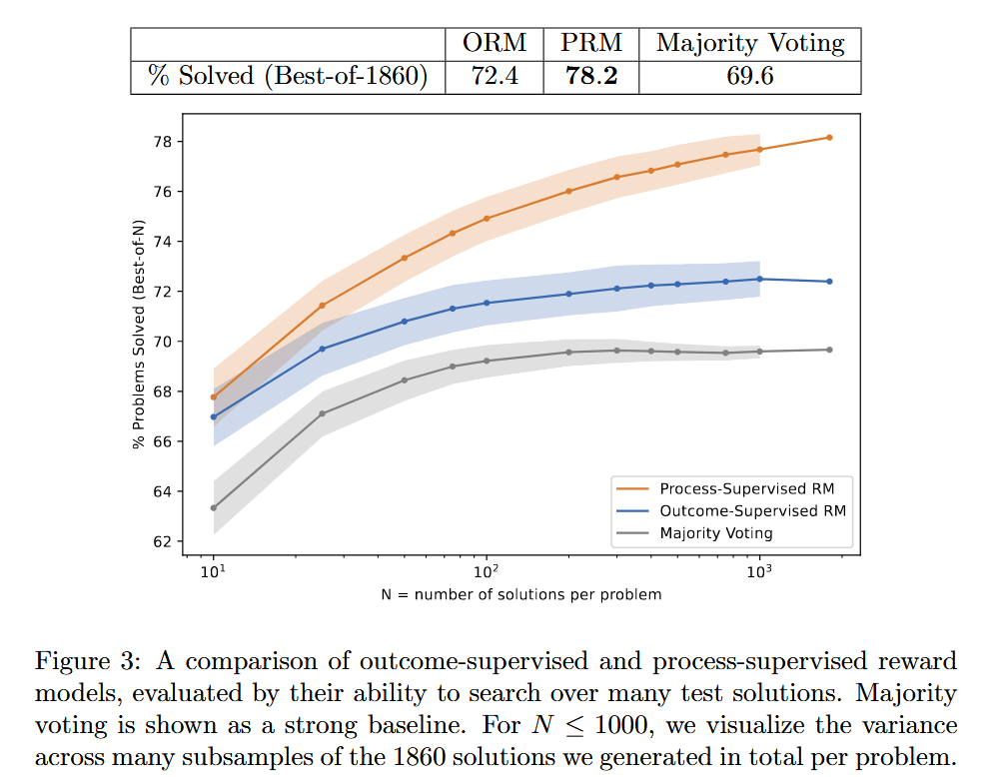

## Let's verify step by step

#### ℹ️基本信息

|                                                                                                                                                                                                                                                                                                                                                                                                                                                                                                                                                                                                                                                                                                                                                                                                                                                                                                                                                                                                                                                                                                                                                                                                                                         |
| --------------------------------------------------------------------------------------------------------------------------------------------------------------------------------------------------------------------------------------------------------------------------------------------------------------------------------------------------------------------------------------------------------------------------------------------------------------------------------------------------------------------------------------------------------------------------------------------------------------------------------------------------------------------------------------------------------------------------------------------------------------------------------------------------------------------------------------------------------------------------------------------------------------------------------------------------------------------------------------------------------------------------------------------------------------------------------------------------------------------------------------------------------------------------------------------------------------------------------------- |
| \*\*期刊:\*\*arxiv（发表年份:**2023**）\*\*作者:**Hunter Lightman; Vineet Kosaraju; Yura Burda; Harri Edwards; Bowen Baker; Teddy Lee; Jan Leike; John Schulman; Ilya Sutskever; Karl Cobbe**机构:\*\*OpenAI                                                                                                                                                                                                                                                                                                                                                                                                                                                                                                                                                                                                                                                                                                                                                                                                                                                                                                                                                                                                                                        |
| \*\*摘要: \*\* In recent years, large language models have greatly improved in their ability to perform complex multi-step reasoning. However, even state-of-the-art models still regularly produce logical mistakes. To train more reliable models, we can turn either to outcome supervision, which provides feedback for a final result, or process supervision, which provides feedback for each intermediate reasoning step. Given the importance of training reliable models, and given the high cost of human feedback, it is important to carefully compare the both methods. Recent work has already begun this comparison, but many questions still remain. We conduct our own investigation, finding that process supervision significantly outperforms outcome supervision for training models to solve problems from the challenging MATH dataset. Our process-supervised model solves 78% of problems from a representative subset of the MATH test set. Additionally, we show that active learning significantly improves the efficacy of process supervision. To support related research, we also release PRM800K, the complete dataset of 800,000 step-level human feedback labels used to train our best reward model. |
| \*\*Local Link: \*\*[Lightman 等 - 2023 - Let's verify step by step.pdf](zotero://open-pdf/0_997C3THU)                                                                                                                                                                                                                                                                                                                                                                                                                                                                                                                                                                                                                                                                                                                                                                                                                                                                                                                                                                                                                                                                                                                                   |

#### 💡一、研究内容

To train more reliable models, we can turn either to outcome supervision, which provides feedback for a final result, or process supervision, which provides feedback for each intermediate reasoning step.

We conduct our own investigation, finding that process supervision significantly outperforms outcome supervision for training models to solve problems from the challenging MATH dataset.

#### 📜二、研究背景

LLMs 能够解决复杂的多步推理任务 （例如COT），但是模型依然容易产生知识幻觉。特别是在需要多步推理的领域，一个小的逻辑错误就可能导致结果的崩溃。

为此，一个有效的方法就是训练可靠的奖励模型来区分期望的和不期望的输出。所以研究如何训练更可靠的奖励模型非常重要。

在最近的研究中，提出了 outcome supervision and process supervision 两种方式用于训练奖励模型：

1.  结果监督奖励模型 (ORM) 仅使用模型思想链的最终结果进行训练
2.  过程监督奖励模型 (PRM) 则接收思想链中每个步骤的反馈。

相比之下，PRM能够提供更加精确的反馈和详细的中间步骤，更加与人类近似。

本文针对两种奖励模型训练方法的效果展开研究。

#### 🔬三、主要方法

ORM模型的训练数据即使用标准的MATH数据集的training set，而对于过程监督数据（PRM），文中使用高昂的人工来标记过程数据每一步的正误。

值得注意的是：当我们讨论结果和过程监督时，我们特指的是对奖励模型的监督。我们不讨论如果使用 RL 进行训练LLMs

最终通过评估哪一个reward model能够更好的对LLMs（generator）的best of N 结果进行正确排序。

#### 🚩四、实验结果

#### 📌五、知识点

#### 🔬六、思考
