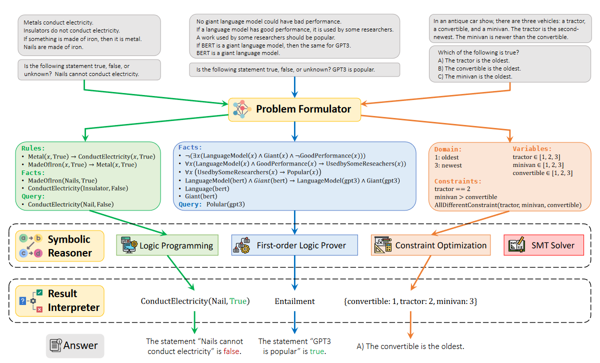
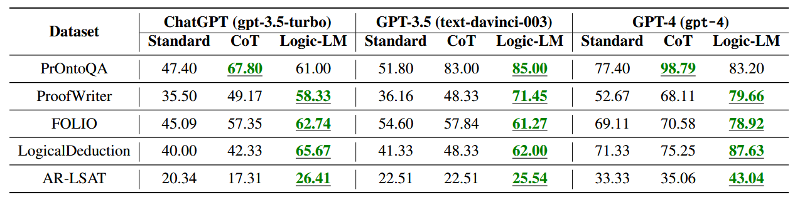
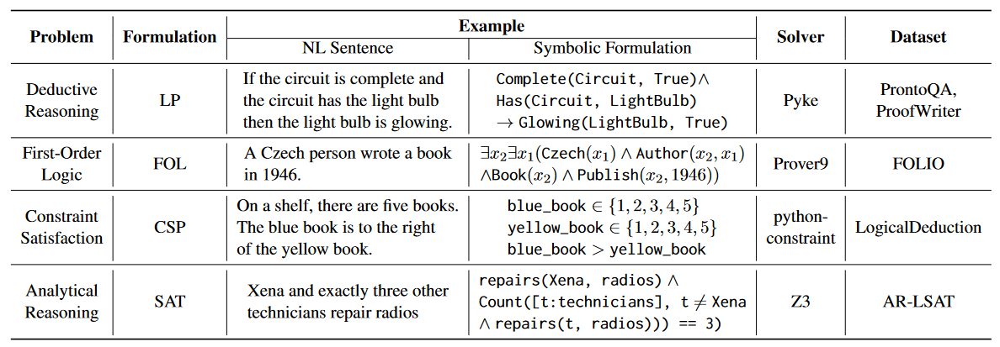

## Logic-LM: Empowering Large Language Models with Symbolic Solvers for Faithful Logical Reasoning

#### ℹ️基本信息

|                                                                                                                                                                                                                                                                                                                                                                                                                                                                                                                                                                                                                                                                                                                                                                                                                                                                                                                                                                                                                                                                                                                                                     |
| --------------------------------------------------------------------------------------------------------------------------------------------------------------------------------------------------------------------------------------------------------------------------------------------------------------------------------------------------------------------------------------------------------------------------------------------------------------------------------------------------------------------------------------------------------------------------------------------------------------------------------------------------------------------------------------------------------------------------------------------------------------------------------------------------------------------------------------------------------------------------------------------------------------------------------------------------------------------------------------------------------------------------------------------------------------------------------------------------------------------------------------------------- |
| **期刊: EMNLP**（发表年份:**2023**）**作者: Liangming Pan; Alon Albalak; Xinyi Wang; William Yang Wang****机构: 加州大学**                                                                                                                                                                                                                                                                                                                                                                                                                                                                                                                                                                                                                                                                                                                                                                                                                                                                                                                                                                                                                                          |
| \*\*摘要:\*\*Large Language Models (LLMs) have shown human-like reasoning abilities but still struggle with complex logical problems. This paper introduces a novel framework, Logic-LM, which integrates LLMs with symbolic solvers to improve logical problem-solving. Our method first utilizes LLMs to translate a natural language problem into a symbolic formulation. Afterward, a deterministic symbolic solver performs inference on the formulated problem. We also introduce a self-refinement module, which utilizes the symbolic solver's error messages to revise symbolic formalizations. We demonstrate Logic-LM's effectiveness on five logical reasoning datasets: ProofWriter, PrOntoQA, FOLIO, LogicalDeduction, and AR-LSAT. On average, Logic-LM achieves a significant performance boost of 39.2% over using LLM alone with standard prompting and 18.4% over LLM with chain-of-thought prompting. Our findings suggest that Logic-LM, by combining LLMs with symbolic logic, offers a promising avenue for faithful logical reasoning. Code and data are publicly available at<https://github.com/teacherpeterpan/Logic-LLM>. |
| \*\*Local Link: \*\*[Pan 等 - 2023 - Logic-LM Empowering Large Language Models with Sy.pdf](zotero://open-pdf/0_RKHX8IKS)                                                                                                                                                                                                                                                                                                                                                                                                                                                                                                                                                                                                                                                                                                                                                                                                                                                                                                                                                                                                                            |

#### 💡一、研究内容

大型语言模型 (LLM) 仍在解决复杂的逻辑问题方面遇到困难。本文介绍了一种新颖的框架 LOGICLM，它将 LLM 与符号求解器集成在一起，以改进逻辑问题求解。首先利用 LLM 将自然语言问题转化为符号公式。然后，确定性符号求解器对公式化的问题进行推理。

#### 📜二、研究背景

逻辑推理是智能系统中的重要部分，目前大模型已经展现出了强大的推理能力，特别是利用COT的方法进行引导。但LLMs仍然难以解决复杂的逻辑推理问题，无法提供确定性的可靠推理。本文介提出了 LOGICLM，它将 LLM 与符号求解器集成在一起，以改进逻辑问题求解，并在五个数据集上验证了效果。问题类型包括：

*   Deductive Reasoning problems：最基本的推理类型，从已知的facts and rules出发，迭代推理出最终的statement是正确还是错误
*   First-Order Logic (FOL) reasoning problems：一阶逻辑推理
*   Constraint Satisfaction Problems (CSP)：约束可满足问题，旨在找到满足多个约束的一组对象的赋值。

#### 🔬三、主要方法

1、问题公式化：利用LLM将自然语言问题转化为相应的符号化形式

2、符号求解器：利用确定性的符号求解器求解上述的公式化问题

3、错误矫正：根据LLM转化的公式和求解器的相应报错信息，让模型进行自查修正

#### 🚩四、实验结果

在五个常见逻辑推理数据集上评估

#### 📌五、知识点

*   问题类型及使用的求解器

*   prover9给定具体的前提或假设，证明目标陈述是否正确

#### 🔬六、思考
