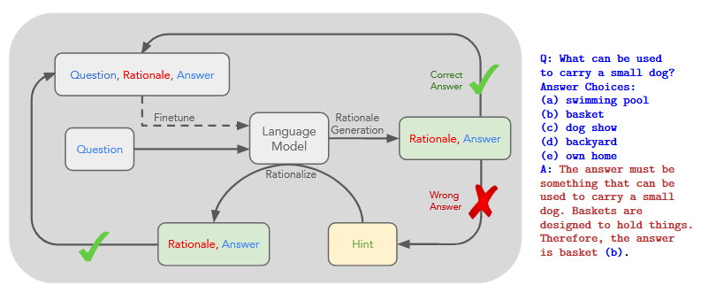
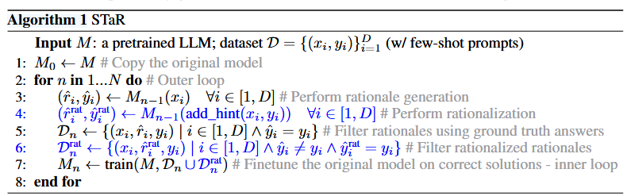
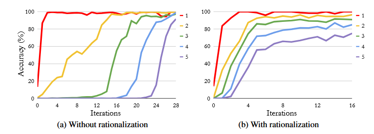

## STaR: Bootstrapping Reasoning With Reasoning

#### ℹ️基本信息

| <!-- --> |
| -------------------------------------------------------------------------------------------------------------------------------------------------------------------------------------------------------------------------------------------------------------------------------------------------------------------------------------------------------------------------------------------------------------------------------------------------------------------------------------------------------------------------------------------------------------------------------------------------------------------------------------------------------------------------------------------------------------------------------------------------------------------------------------------------------------------------------------------------------------------------------------------------------------------------------------------------------------------------------------------------------------------------------------------------------------------------------------------------------------------------------------------------------------------------------------------------------------------------------------------------------------------------- |
| **期刊:********（发表年份: **2022**） **作者:** Eric Zelikman; Yuhuai Wu; Jesse Mu; Noah D. Goodman **机构:** 斯坦福，谷歌                                                                                                                                                                                                                                                                                                                                                                                                                                                                                                                                                                                                                                                                                                                                                                                                                                                                                                                                                                                                                                                                                                                                                      |
| **摘要: ***Generating step-by-step "chain-of-thought" rationales improves language model performance on complex reasoning tasks like mathematics or commonsense question-answering. However, inducing language model rationale generation currently requires either constructing massive rationale datasets or sacrificing accuracy by using only few-shot inference. We propose a technique to iteratively leverage a small number of rationale examples and a large dataset without rationales, to bootstrap the ability to perform successively more complex reasoning. This technique, the "Self-Taught Reasoner" (STaR), relies on a simple loop: generate rationales to answer many questions, prompted with a few rationale examples; if the generated answers are wrong, try again to generate a rationale given the correct answer; fine-tune on all the rationales that ultimately yielded correct answers; repeat. We show that STaR significantly improves performance on multiple datasets compared to a model fine-tuned to directly predict final answers, and performs comparably to fine-tuning a 30$\times$ larger state-of-the-art language model on CommensenseQA. Thus, STaR lets a model improve itself by learning from its own generated reasoning.* |
| <!-- 原文pdf链接 -->**Local Link: **[Zelikman 等 - 2022 - STaR Bootstrapping Reasoning With Reasoning.pdf](zotero://open-pdf/0_BK5TT4LZ)                                                                                                                                                                                                                                                                                                                                                                                                                                                                                                                                                                                                                                                                                                                                                                                                                                                                                                                                                                                                                                                                                                                                        |

#### 💡一、研究内容

旨在解决如何提高语言模型在复杂推理任务上的性能，例如数学问题解答或常识问答。它的主要特点不依赖标注数据，通过自我迭代模型来生成数据（CoT）。

#### 📜二、研究背景

生成逐步的“思想链”理由改善了在数学或常识性问题（常识性问题）等复杂的推理任务上的语言模型表现。但是，当前诱导语言模型的基本原理生成需要构建大规模的理由数据集或仅使用少量射击推理来牺牲准确性。我们提出了一种技术，以迭代地利用少量的理由示例和一个没有理由的大型数据集，以引导执行更复杂的推理的能力。

#### 🔬三、主要方法

依赖一个简单的循环：生成推理过程来回答许多问题，并以一些cot示例提示；如果生成的答案是错误的，请再次尝试给定正确的答案生成理由；最终利用所有得出正确答案的cot数据对模型进行微调训练；

初始化-》推理过程生成-》正确性检查-》错误答案合理化-》模型训练 （迭代上述过程）

#### 🚩四、实验结果

实验部分有一个比较有意思的地方，尽管rationalization能够让模型收敛的更快，但是最终的峰值似乎是更低的（**这是不是因为生成的rationale尽管答案正确，但过程可能是错误的，所以带来了幻觉？**）

#### 📌五、知识点

#### 🔬六、思考

值得注意的是：

1. 为了避免过拟合，每次微调训练的都是original model
2. 其次，模型训练和测试的都是同分布的数据集
3. 算法中蓝色的合理化部分，论文中认为非常重要，有助于帮助模型学会difficult的问题

limitations：

1. 生成的推理过程颗粒度太粗了，没有关注每一步的推理合理性
2. 答案正确，推理过程也可能不正确
