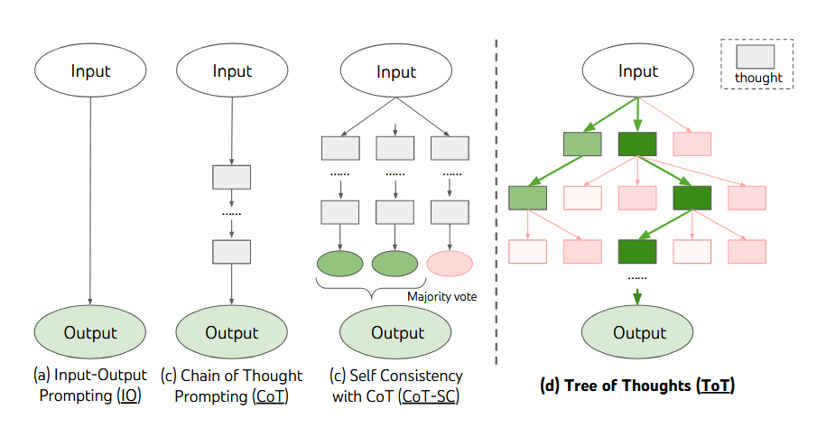
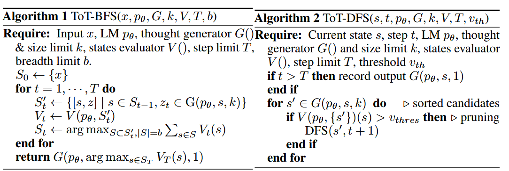
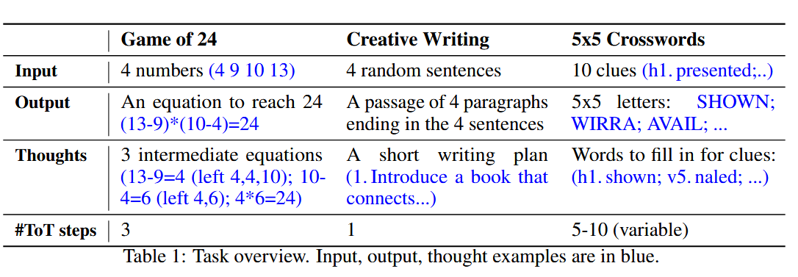

## Tree of thoughts: Deliberate problem solving with large language models

#### ℹ️基本信息

|                                                                                                                                                                                                                                                                                                                                                                                                                                                                                                                                                                                                                                                                                                                                                                                                                                                                                                                                                                                                                                                                                                                                                                                                                                                                                                                                                                                                                     |
| ------------------------------------------------------------------------------------------------------------------------------------------------------------------------------------------------------------------------------------------------------------------------------------------------------------------------------------------------------------------------------------------------------------------------------------------------------------------------------------------------------------------------------------------------------------------------------------------------------------------------------------------------------------------------------------------------------------------------------------------------------------------------------------------------------------------------------------------------------------------------------------------------------------------------------------------------------------------------------------------------------------------------------------------------------------------------------------------------------------------------------------------------------------------------------------------------------------------------------------------------------------------------------------------------------------------------------------------------------------------------------------------------------------------- |
| **期刊:**\*\*\*\*\*\*（发表年份:**2023**）**作者:Shunyu Yao; Dian Yu; Jeffrey Zhao; Izhak Shafran; Thomas L. Griffiths; Yuan Cao; Karthik Narasimhan机构:**                                                                                                                                                                                                                                                                                                                                                                                                                                                                                                                                                                                                                                                                                                                                                                                                                                                                                                                                                                                                                                                                                                                                                                                                                                                                     |
| **摘要**: Language models are increasingly being deployed for general problem solving across a wide range of tasks, but are\*\*still confined to token-level, left-to-right decision-making processes during inference.\*\*This means they can fall short in tasks that require exploration, strategic lookahead, or where initial decisions play a pivotal role. To surmount these challenges, we introduce a new framework for language model inference,\*\*Tree of Thoughts (ToT), which generalizes over the popular Chain of Thought approach to prompting language models, and enables exploration over coherent units of text (thoughts) that serve as intermediate steps toward problem solving.\*\*ToT allows LMs to perform deliberate decision making by considering multiple different reasoning paths and self-evaluating choices to decide the next course of action, as well as looking ahead or backtracking when necessary to make global choices. Our experiments show that ToT significantly enhances language models' problem-solving abilities on three novel tasks requiring non-trivial planning or search: Game of 24, Creative Writing, and Mini Crosswords. For instance, in Game of 24, while GPT-4 with chain-of-thought prompting only solved 4% of tasks, our method achieved a success rate of 74%. Code repo with all prompts:<https://github.com/princeton-nlp/tree-of-thought-llm>. |
| \*\*Local Link: \*\*[Yao 等 - 2023 - Tree of thoughts Deliberate problem solving with large language models.pdf](zotero://open-pdf/0_8IZWNMDL)                                                                                                                                                                                                                                                                                                                                                                                                                                                                                                                                                                                                                                                                                                                                                                                                                                                                                                                                                                                                                                                                                                                                                                                                                                                                       |

#### 💡一、研究内容

Language models **still confined to token-level, left-to-right decision-making processes during inference.**

**Tree of Thoughts (ToT), which generalizes over the popular Chain of Thought approach to prompting language models, and enables exploration over coherent units of text (thoughts) that serve as intermediate steps toward problem solving.**

ToT allows LMs to perform deliberate decision making by considering multiple different reasoning paths and self-evaluating choices to decide the next course of action, as well as looking ahead or backtracking when necessary to make global choices.

#### 📜二、研究背景

对“双重过程”模型的研究表明，人们有两种参与决策的模式：

1.  快速、自动、无意识模式（“系统1”）
2.  缓慢、深思熟虑、有意识的模式（“系统2”）

目前，LLMs基于token-level的推理过程，往往还停留在系统1，而更加缓慢、深思熟虑的推理过程可能对模型有益的，即：（1）相比于仅仅做出一个决策，维护并探索当前选择的多种代替方案；（2）评估当前状况并积极展望未来或回溯以做出更全面的决策。

**现有大模型的缺点：1）局部性：现有LM模型不会在思维过程中探索不同的延续，即不会去探索当前节点的其他分支解决方案。2）缺乏全局性：大模型LM没有纳入任何类型的规划、展望或回溯来帮助评估不同的选项。**

人类推理特点：**可以重复使用可用的信息来进行启发式的探索，促使挖掘出更多真正有用的信息，找到最终的解决方案。**

为了设计如人类这样的决策过程，一个直觉的方案就是将推理过程建模为tree search的形式

> Newell and colleagues characterized problem solving as search through a combinatorial problem space, represented as a tree.

将这种基于语言的能力与搜索算法相结合，以生成和评估各种想法，例如广度优先搜索 (BFS) 或深度优先搜索 (DFS)，这些算法允许通过前瞻和回溯来系统地探索思维树。

#### 🔬三、主要方法

> A genuine problem-solving process involves the repeated use of available information to initiate exploration, which discloses, in turn, more information until a way to attain the solution is finally discovered.—— Newell et al.

ToT的具体实例涉及回答四个问题：

1.  如何将中间过程分解为思维步骤：根据问题类型进行特定的设计，每一个思维不能太大，也不能太小
2.  如何从每个状态中产生潜在的想法：直接与COT类似进行采样，或者使用propose prompt的方式
3.  如何启发式评估状态：独立的评估每个状态，或者采用投票方式评估选择几个状态中最好的那个。
4.  使用什么搜索算法。

#### 🚩四、实验结果

#### 🔬五、思考

limitation：

1.  有些场景用不上这样复杂的方法，且thought设计起来具有一定的challenge
2.  多次调用api代价较大
3.  不使用这样的方法对LLMs的思考过程进行微调，会影响模型效果
