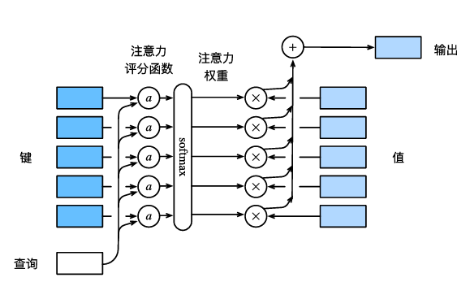

## 大模型相关知识整理

#### 一、熵

在机器学习和统计学中，熵是一种信息论的度量，表示系统的随机性或不确定性。**熵越高，代表不确定性越高。**

* **交叉熵（Cross-Entropy）**

​	衡量了实际标签与预测概率分布之间的差异，交叉熵损失函数在机器学习和深度学习中被广泛应用于训练分类模型，如逻辑回归、神经网络等。

​	具体的，对于一个K分类任务，假设模型的输出是一个概率分布$\mathbf{p} = [p_1, p_2, \ldots, p_K]$，其中 $p_i$ 是模型预测样本属于类别 i的概率。实际的标签用一个独热编码向量 $\mathbf{y} = [y_1, y_2, \ldots, y_K]$表示(0或1),交叉熵损失函数$\mathbf{L}$为：
$$
\mathbf{L}(y,p)=-\sum_{i=1}^{K}y_ilog(p_i)
$$

* **预测熵（Predictive Entropy）**

​	一种衡量预测模型不确定性的指标。如果模型对某一类别的预测概率非常高（接近1），而对其他类别的预测概率非常低（接近0），那么预测熵会很低，表示模型对其预测结果非常有信心。

​	具体的，假设模型的输出是一个概率分布$\mathbf{p} = [p_1, p_2, \ldots, p_K]$，其中 $p_i$ 是模型预测样本属于类别 i的概率。预测熵 $H(\mathbf{p})$定义为：
$$
\mathbf{H}(p)=-\sum_{i=1}^{K}p_ilog(p_i)
$$

#### 二、拒绝采样

#### 三、大模型理论（LLMs）

https://arxiv.org/pdf/2401.01286

###### 2.1 大模型架构

[深度学习进阶篇[1\]：Transformer模型原理;应用详解 - Heywhale.com](https://www.heywhale.com/mw/project/646d809b8fe9066e5c0d9eee)

目前，大型语言模型主要以Transformer架构作为基础，包含Encoder和Decoder两部分，每部分都是由多个相同的block层连接在一起，而每个block layer又包含自主意力层和前馈神经网络层。现有的大模型架构主要以Decoder-only为主

* ***Embedding层***

  包括input embedding和positional encoding，前者将输入的token（one-hot编码形式）转化为向量模式，后者在此基础上加上用于表示单词顺序的位置编码向量。

  * input embedding：可以看作一个lookup table，对于每个 word查出一个对应向量编码结果。

  * positional encoding：维度和input embedding 的维度一样，这个向量能决定当前词的位置，或者说在一个句子中不同的词之间的距离。计算方法如下：

    

* ***自注意力层（Self-Attention）***  

​	自主意力层是Transformer架构中的核心机制，相比于之前的RNN等序列网络，自注意力层能够并行高效的处理文本数据，并且能够捕获嵌入序列中的上下文信息。
$$
H = AAT(Q,K,V)=Softmax(\frac{QK^T}{\sqrt{d_k}})V
$$
其中Q，K，V分别代表查询，健，值。通俗来讲，自注意力机制的思想就是：当encoder某个位置的编码表示（语义空间）时，会根据查询与每个位置的**键**的关系计算每个位置的***值***的考虑权重，从而综合编码该位置的语义表示。

上图中给出了，对于一个查询向量q的计算过程，而在自然语言序列中，每个word都相当于一个查询q，总的查询向量即为Q；从开始的embedding层输出的序列向量，根据三个权重向量$W^Q,Q^K,Q^V$计算得到Q，K，V。再根据上述的计算公式，就可以得到整个文本序列每个token位置对应的语义编码中间向量H。

多头自注意力即是在上述基础上，多了n个的$W^Q_i,Q^K_i,Q^V_i$。与之对应的，最后的结果$H=W^o*[h_1,h_2,...,h_n]^T$

> [!IMPORTANT]
>
> 此外，值得注意的是，现有的生成式大模型往往仅使用decoder层，采用**掩码注意力层编码**，并且**每次只编码当前位置和其之前的token的语义信息**，再将输出的token拼接到输入中，然后不断循环输出。
>
> Mask 非常简单，首先生成一个下三角全 0，上三角全为负无穷的矩阵，然后将其与 Scaled Scores 相加即可，之后再做 softmax，就能将 -inf 变为 0，得到的这个矩阵即为每个字之间的权重。

* ***前馈神经网络（FFN）***

​	FFN将从自注意力层得到的向量再投影到一个更大的空间，从而更方便地提取需要的信息（使用 Relu 激活函数），最后再投影回 token 向量原来的空间。***借鉴 SVM 来理解：SVM 对于比较复杂的问题通过将特征其投影到更高维的空间使得问题简单到一个超平面就能解决。***FFN包含两层的线性层：
$$
FFN(x)=ReLU(x\cdot w_1+b_1)\cdot w_2+b2

$$
* ***残差链接和层归一化***

  这部分操作不会改变向量的大小

* ***最后一层和softmax层***：

  线性层是一个简单的全连接的神经网络，它将Decoder生成的向量投影到一个更大的向量，称为 logits 向量（相当于将向量表示，映射回词汇表中权重）。softmax 层将这些分数转换为概率（全部为正值，总和为 1.0）。选择概率最高的单元，并生成与其关联的单词作为此时间步的输出。

  

> [!IMPORTANT]
>
> Transformer 的权重共享
>
> - （1）Encoder 和 Decoder 间的 Embedding 层权重共享；
> - （2）Decoder 中 Embedding 层和 FC 层（最后一层）权重共享；

###### 2.2 从矩阵计算的角度理解模型的全架构

假设B为批量大小，S为序列长度，V为词汇表大小，H为hidden向量的维度（也是token被embedding以后的维度）

* **embedding层**：
  $$
  [B, S, V] * W --> [B, S, H]
  $$
  

* **Self-Attention层：**

  单头：
  $$
  W^Q,W^K,W^V = [H,H],[H,H],[H,H] \\
  Q, K, V = [B, S, H] * W^Q,[B, S, H] * W^K,[B, S, H] * W^V \\
  =[B, S, H] *[H,H],[B, S, H] *[H,H],[B, S, H] *[H,H]
  $$
  多头：
  $$
  W^Q,W^K,W^V = [h*H,h*H],[h*H,h*H],[h*H,h*H] \\
  Q, K, V = [B, S, H] * W^Q,[B, S, H] * W^K,[B, S, H] * W^V \\
  =[B, S, h,H] *[h*H,h*H],[B, S,h, H] *[h*H,h*H],[B, S, h,H] *[h*H,h*H] \\
  $$
  attention计算：
  $$
  X=softmax(Q*K^T)*V = [B, h, S,H]*[B, h, S,H]^T *  [B, h, S,H]=[B, h, S,S]*[B, h, S,H] = [B, h, S,H]
  $$

  $$
  X*W^o =[B, h, S,H]*[ h*H,H] = [B, S,H]
  $$

* **FNN层**：
  $$
  RElu([B, S,H]*[H,F])*[F,H] = [B, S,H]
  $$

* **Linear层**：
  $$
  [B, S,H]*[H,V] = [B, S,V]
  $$

###### 2.3 模型参数量和计算量

* attention模块：
  $$
  8BSH^2+4BHS^2
  $$

* FNN模块：
  $$
  16BSH^2
  $$

那要是有多层，我们就乘以L，所以最后的整体Transfomer所有参数的算力消耗(一次前向计算啊，没算反向传播)

* 静态显存：

  静态显存占用的最基本逻辑就是load模型参数，但是别忘了在训练的过程中，同时还要保存另外两个重要的东西：梯度和优化器。在一次用AdamW和混合精度训练的Epcho里，每一个模型参数，需要占用：

  - 2byte的模型静态参数权重（以16bit存储）
  - 2byte的模型更新参数权重（以16bit存储）
  - 2byte的梯度（以16bit存储）
  - 2byte的梯度更新（以16bit存储）
  - 4byte的一阶动量优化器更新（以32bit存储）
  - 4byte的二阶方差优化器更新（以32bit存储

  所以在训练的过程中，一个模型参数需要占用16bytes的内存。

  除了训练时load的以上各种参数相关的权重以外，最终要的是输入模型进行训练的token的batchsize长度和单个训练的seq_number,这两个值会直接影响到我到底要load多少数据，这部分数据会和刚才讲的参数占用的显存一起构成训练过程中的显存消耗。

###### 2.3 大模型知识存储机制（Knowledge storge）

