## 强化学习笔记

https://datawhalechina.github.io/easy-rl/#/

**强化学习（Reinforcement Learning，RL）**

讨论的问题是智能体（agent）怎么在复杂、不确定的环境（environment）中最大化它能获得的奖励。

强化学习由两部分组成：**智能体和环境**。在强化学习过程中，智能体与环境一直在交互。智能体在环境中获取某个**状态**后，它会利用该状态输出一个**动作** （action），这个动作也称为决策（decision）。然后这个动作会在环境中被执行，环境会根据智能体采取的动作，输出下一个状态以及当前这个动作带来的**奖励**。智能体的目的就是学到一种近似最优的**策略（采取动作的方式）**，从而尽可能多地从环境中获取奖励。

### Chapter 1、强化学习基本概念

> [!CAUTION]
>
> 在监督学习过程中，有两个假设。第一，输入的数据之间（标注的数据）都应是没有关联的。因为如果输入的数据有关联，学习器（learner）是不好学习的；第二，我们告诉学习器正确的标签是什么，这样它可以通过正确的标签来修正自己的预测。
>
> **监督学习与强化学习的区别：**
>
> （1）强化学习输入的样本是**序列数据**，而不像监督学习里面样本都是独立的。 
>
> （2）学习器并没有告诉我们每一步正确的动作应该是什么，学习器需要自己去发现哪些动作可以带来最多的奖励，只能通过不停地尝试来发现最有利的动作。
>
> （3）智能体获得自己能力的过程，其实是不断地试错探索（trial-and-error exploration）的过程。**探索 （exploration）和利用（exploitation）**是强化学习里面非常核心的问题。（两者之前的权衡和博弈）

#### 1.1 基本元素

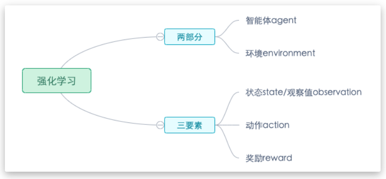

- **环境(Environment)** 是一个外部系统，智能体处于这个系统中，能够感知到这个系统并且能够基于感知到的状态做出一定的行动。
- **智能体(Agent)** 是一个嵌入到环境中的系统，能够通过采取行动来改变环境的状态。
- **状态(State)/观察值(Observation)**：状态是对世界的完整描述，不会隐藏世界的信息。观测是对状态的部分描述，可能会遗漏一些信息。
- **动作(Action)**：不同的环境允许不同种类的动作，在给定的环境中，有效动作的集合经常被称为动作空间(action space)，包括离散动作空间(discrete action spaces)和连续动作空间(continuous action spaces)，例如，走迷宫机器人如果只有东南西北这 4 种移动方式，则其为离散动作空间;如果机器人向 360◦ 中的任意角度都可以移动，则为连续动作空间。
- **奖励(Reward)**：是由环境给的一个标量的反馈信号(scalar feedback signal)，这个信号显示了智能体在某一步采取了某个策略的表现如何。

> [!IMPORTANT]
>
> 值得注意的是，在强化学习中，奖励（Reward）通常指每个时刻的瞬时汇报，对于期望的总体回报为：
> $$
> G_t= \gamma R_t+\gamma^2 R_{t+1}+\gamma^3 R_{t+2}+...
> $$

#### 1.2 强化学习智能体的组成成分

1、**策略（policy）**：智能体会用策略来选取下一步的动作，包括随机性策略和确定性策略
$$
π(a | s) = p (a_t = a | s_t = s)
$$
2、**价值函数（value function）**：我们用价值函数来对当前状态进行评估。价值函数用于评估智能体进 入某个状态后，可以对后面的奖励带来多大的影响。价值函数值越大，说明智能体进入这个状态越有利。 

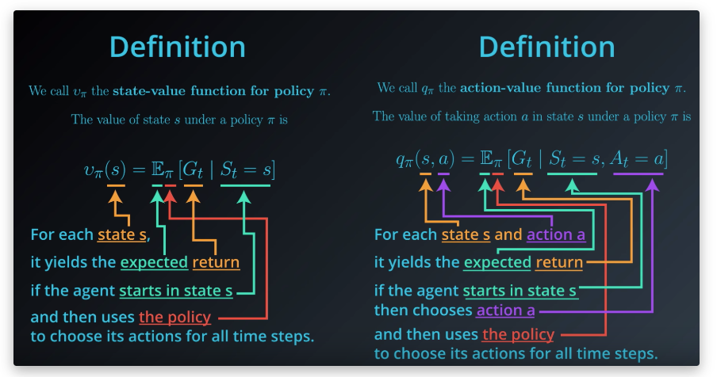

- 状态价值函数(State-value Function)：用来度量给定策略 $π$ 的情况下，当前状态 $s_t$ 的好坏程度。
  $$
  V_π(s)= E_π [G_t| s_t = s] = 
  E_π\left[ \sum_{k=0}^{\infty}\gamma^kr_{t+k+1}|s_t=s \right]
  $$
  **这里使用了期望是因为策略不是固定的，具有随机性**；此外，即便是采用相同的动作，也可能进行不同的状态
  
- 动作价值函数(Action-value Function)：用来度量给定状态 $s_t$ 和策略 $π$ 的情况下，采用动作 $a_t$ 的好坏程度。
  $$
  Q_π(s,a)= E_π [G_t| s_t = s,a_t=a] = 
  E_π\left[ \sum_{k=0}^{\infty}\gamma^kr_{t+k+1}|s_t=s,a_t=a \right]
  $$

​	

> [!NOTE]
>
> 从intuition的角度解释，Q和V的关系：
>
> 1. V表示s状态所能带来的奖励
> 2. Q表示s状态采用动作a所带来的奖励
> 3. 用Q解释V，s状态所有的a所带来的Q之和

3、**模型（model）**：模型表示智能体对环境的状态进行理解，它决定了环境中世界的运行方式，由状态转移概率和奖励函数两个部分组成。

* 状态转移：
  $$
  p^a_{ss′} = p (s_{t+1} = s′| s_t = s, a_t = a)
  $$

* 奖励函数：在当前状态采取了某个动作，可以得到多大的奖励 （采取某个动作所获得的奖励也不是固定的）奖励的另一种表示方式：
  $$
  R(s, a) = E [r_{t+1} | s_t = s, a_t = a]
  $$
  
  奖励的另一种表示方式：
  $$
  p (r | s_t = s, a_t = a)
  $$
  
  > [!NOTE]
  >
  > 奖励依赖于当前时刻的状态和采取的动作，与下一时刻的状态无关
  
  

当我们有了策略、价值函数和模型 3 个组成部分后，就形成了一个**马尔可夫决策过程（Markov decision process）**。

#### 1.3 强化学习算法分类

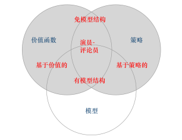

1、按照环境是否已知划分：免模型学习（Model-Free） vs 有模型学习（Model-Based）

- **Model-free**就是不去学习和理解环境，环境给出什么信息就是什么信息，常见的方法有policy optimization和Q-learning。
- **Model-Based**是去学习和理解环境，学会用一个模型来模拟环境，通过模拟的环境来得到反馈。Model-Based相当于比Model-Free多了模拟环境这个环节，通过模拟环境预判接下来会发生的所有情况，然后选择最佳的情况。

2、按照学习目标划分：基于策略（Policy-Based）和基于价值（Value-Based）

- **Policy-Based **的方法直接输出下一步动作的概率，根据概率来选取动作。但不一定概率最高就会选择该动作，还是会从整体进行考虑。适用于非连续和连续的动作。常见的方法有Policy gradients。
- **Value-Based** 的方法输出的是动作的价值，选择价值最高的动作。适用于非连续的动作。常见的方法有Q-learning、Deep Q Network和Sarsa。
- 更为厉害的方法是二者的结合：Actor-Critic，Actor根据概率做出动作，Critic根据动作给出价值，从而加速学习过程，常见的有A2C，A3C，DDPG等。

### Chapter 2、强化学习基础——马尔可夫

通过将强化学习过程建模为马尔可夫过程，能够更加方便的进行求解

#### 2.1 马尔可夫过程

1、马尔可夫性质

**马尔可夫性质（Markov property）**是指一个随机过程在给定现在状态及所有过去状态情况下，其未来状态的条件概率分布仅依赖于当前状态。假设随机变量 $X_0, X_1, · · · , X_T$ 构成一个随机过程。这些随机变量的所有可能取值的集合被称为状态空间（state space）。 如果 $X_{t+1}$ 对于过去状态的条件概率分布仅是 $X_t$ 的一个函数，则:
$$
p (X_{t+1}= x_{t+1} | X_{0:t} = x_{0:t}) = p (X_{t+1} = x_{t+1} | X_t = x_t)
$$
2、马尔可夫链

离散时间的马尔可夫过程也称为马尔可夫链（Markov chain）。马尔可夫链是最简单的马尔可夫过 程，其状态是有限的。

#### 2.2 马尔可夫奖励过程

**1、马尔可夫奖励过程**：

马尔可夫链加上奖励函数
$$
V_π(s)= E_π [G_t| s_t = s] = 
E_π\left[ \sum_{k=0}^{\infty}\gamma^kr_{t+k+1}|s_t=s \right]
$$
奖励函数是评估当前状态好坏的直观表现，给一个例子其奖励函数可以定义为：智能体进入第一个状态 s1 的时候会得到 5 的奖励，进入第七个状态 s7 的时候会 得到 10 的奖励，进入其他状态都没有奖励。我们可以用向量来表示奖励函数，用图来表示状态转移概率：
$$
R=[5,0,0,0,0,0,10]
$$
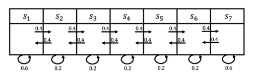

可以发现，从一个状态开始（比如 $s_4$）有多种状态转义方式，那如何计算价值函数呢？一个可行的做法就是我们可以生成很多轨迹，然 后把轨迹都叠加起来。比如我们可以从 s4 开始，采样生成很多轨迹，把这些轨迹的回报都计算出来，然后 将其取平均值作为我们进入 s4 的价值。这其实是一种计算价值函数的办法，也就是通过**蒙特卡洛（Monte Carlo，MC）采样**的方法计算 s4 的价值。

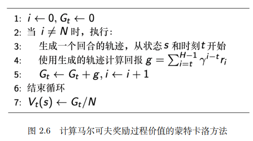

而下面我们介绍一种更直接的方式

**2、贝尔曼方程**

###### 贝尔曼方程就是当前状态与未来状态的迭代关系，表示当前状态的价值函数可以通过下个状态的价值函数来计算。贝尔曼方程因其提出者、动态规划创始人理查德 · 贝尔曼（Richard Bellman）而得 名，也叫作“动态规划方程”。

$$
\begin{align}
V_π(s) &= E_π [G_t| s_t = s]\\ 
&= E_π[r_{t+1}+\gamma r_{t+2}+\gamma^2r_{t+3+...}|s_t=s ] \\
&= E_π[r_{t+1}|s_t=s ]+ \gamma E_π[r_{t+2}+\gamma r_{t+3+...}|s_t=s ] \\
&= R(s)+ \gamma E_π[G_{t+1}|s_t=s ] \\
&= R(s)+ \gamma E_π[V_π(s_{t+1})|s_t=s ] （这一步是推导的关键，利用了全期望公式）\\
&=R(s)+\gamma  \sum_{s^`\in S}P(s^`|s)V_π(s^`)
\end{align}
$$
在有了这样的状态函数递推关系之后，就可以求解状态价值函数。一种直观的方式就是直接利用矩阵的性质进行求导：

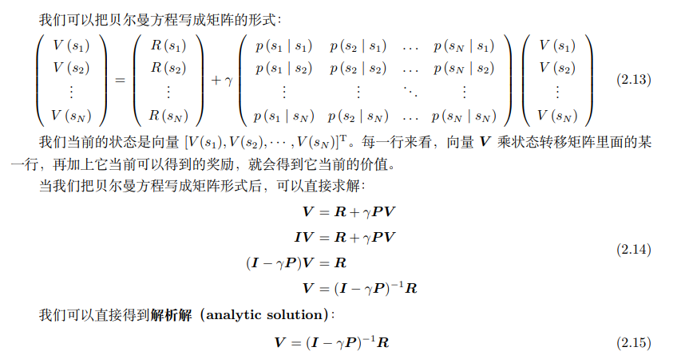

还可以利用一些迭代算法进行求解，上面提到的蒙特卡洛采样就是一种，除此之外，还可以使用动态规划：通过自举（bootstrapping）的方法不停地迭代贝尔曼方程，当最后更新的 状态与我们上一个状态的区别并不大的时候，更新就可以停止

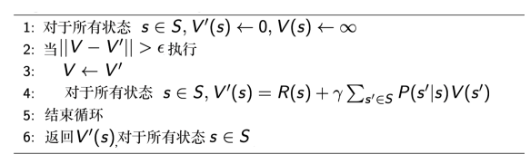

#### 2.3 马尔可夫决策过程

马尔可夫决策过程多了决策（决策是指动作），未来的状态不 仅依赖于当前的状态，也依赖于在当前状态智能体采取的动作。
$$
p^a_{ss′} = p (s_{t+1} = s′| s_t = s, a_t = a)
$$

$$
R(s, a) = E [r_{t+1} | s_t = s, a_t = a]
$$

策略定义了在某一个状态应该采取什么样的动作。知道当前状态后，我们可以把当前状态代入策略函 数来得到一个概率，即
$$
 π(a | s) = p (a_t = a | s_t = s)
$$

> [!IMPORTANT]
>
> 马尔可夫决策过程和马尔可夫过程/马尔可夫奖励过程的区别:
>
> 马尔可夫过程/马尔可夫奖励过程的状态转移是直接决定的。比如当前状态是 s，那么直接通过转 移概率决定下一个状态是什么。但对于马尔可夫决策过程，它**的中间多了一层动作 a ，即智能体在当前状 态的时候，首先要决定采取某一种动作**，这样我们会到达某一个黑色的节点。到达这个黑色的节点后，因 为有一定的不确定性，所以当智能体当前状态以及智能体当前采取的动作决定过后，智能体进入未来的状 态其实也是一个概率分布。**在当前状态与未来状态转移过程中多了一层决策性，而这样的决策性正是强化学习智能体的特点**
>
> 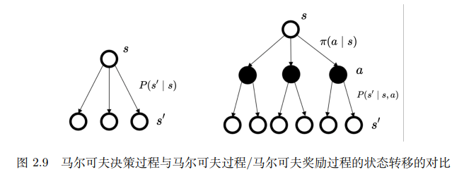

已知马尔可夫决策过程和策略 π，我们可以把马尔可夫决策过程转换成马尔可夫奖励过程：
$$
P_π (s′| s) = \sum_{a\in A} π(a | s)p (s′| s, a)
$$

$$
r_π (s) = \sum_{a\in A} π(a | s)R(s,a)
$$

**1、马尔可夫决策过程中的价值函数**

马尔可夫过程中的状态价值函数，与前面相同，也为：
$$
V_π(s)= E_π [G_t| s_t = s]
$$
此外我们另外引入了一个 Q 函数（Q-function）：Q 函数也被称为动作价值函数（action-value function）。Q 函数定义的是在某一个状态采取某一个动作，有可能得到的回报的一个期望：
$$
Q_π(s,a)= E_π [G_t| s_t = s,a_t=a]
$$
考虑两者之间的关系，通过对策略函数进行加和，可以将状态价值函数表示为动作价值函数的形式：
$$
V_π(s)=\sum_{a\in A}π(a | s)Q_π(s,a)
$$
同时与上面类似，动作价值函数也具有贝尔曼转移方程：
$$
Q_π(s,a) =R(s,a)+\gamma  \sum_{s^`\in S}P(s^`|s,a)V_π(s^`)
$$
推导过程：
$$
\begin{align}
Q_π(s,a) &= E_π [G_t| s_t = s,a_t=a]\\ 
&= E_π[r_{t+1}+\gamma r_{t+2}+\gamma^2r_{t+3+...}|s_t=s ,a_t=a] \\
&= E_π[r_{t+1}|s_t=s ,a_t=a]+ \gamma E_π[r_{t+2}+\gamma r_{t+3+...}|s_t=s,a_t=a] \\
&= R(s,a)+ \gamma E_π[G_{t+1}|s_t=s ,a_t=a] \\
&= R(s,a)+ \gamma E_π[V_π(s_{t+1})|s_t=s,a_t=a ] （这一步是推导的关键，利用了全期望公式）\\
&=R(s,a)+\gamma  \sum_{s^`\in S}P(s^`|s,a)V_π(s^`)
\end{align}
$$
**2、贝尔曼期望方程**

可以把状态价值函数和 Q 函数拆解成两个部分：即时奖励和后续状态的折扣价值（discounted value of successor state）。通过对状态价值函数进行分解，我们就可以得到一个类似于之前马尔可夫奖励 过程的贝尔曼方程——贝尔曼期望方程（Bellman expectation equation）：
$$
V_π(s)= E_π [r_{t+1}+\gamma V_π(s_{t+1})| s_t = s]
$$

$$
Q_π(s,a)= E_π [r_{t+1}+\gamma Q_π(s_{t+1},a_{t+1})| s_t = s,a_t=a]
$$

再结合上面的三个公式，就可以推导出在马尔可夫决策过程中的另一种形式的贝尔曼期望方程：
$$
V_π(s)=\sum_{a\in A}π(a | s)\left(R(s,a)+\gamma  \sum_{s^`\in S}P(s^`|s,a)V_π(s^`) \right)
$$

$$
Q_π(s,a) =R(s,a)+\gamma  \sum_{s^`\in S}P(s^`|s,a) \sum_{a^`\in A}π(a^` | s^`)Q_π(s^`,a^`)
$$

> [!NOTE]
>
> 到此为止，我们已经介绍完了强化学习主要的基础知识，在有了这些建模形式后，剩下的问题就在于如何进行求解计算。在上面马尔可夫奖励过程中，我们可以用动态规划和MCTS的方式进行求解计算，但与之相比马尔可夫决策过程更加的复杂，并且涉及到**策略的更新和选择**。下面就让我们来看一下如何进行求解。

备份图和贝尔曼期望方程的图解计算过程：

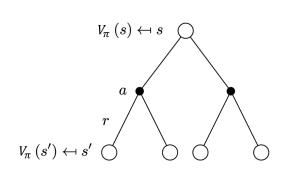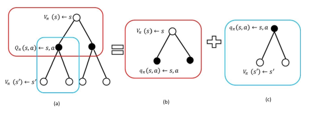

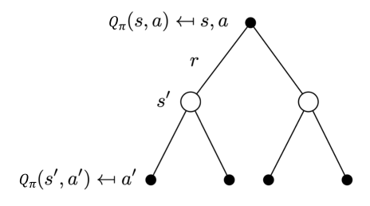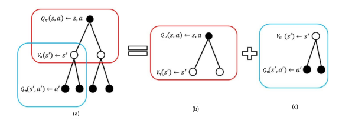

**3、马尔可夫决策过程中的预测和控制**

预测（评估一个给定的策略）的输入是马尔可夫决策过程 < S, A, P, R, γ > 和策略 π，输出是价值函 数 Vπ。预测是指给定一个马尔可夫决策过程以及一个策略 π ，计算它的价值函数，也就是计算每个状态 的价值。 

控制（搜索最佳策略）的输入是马尔可夫决策过程 < S, A, P, R, γ >，输出是最佳价值函数（optimal value function）V ∗ 和最佳策略（optimal policy）π ∗。控制就是我们去寻找一个最佳的策略，然后同时输 出它的最佳价值函数以及最佳策略。

> [!IMPORTANT]
>
> 解决强化学习问题意味着要寻找一个最优的策略让个体在与环境交互过程中获得始终比其它策略都要多的收获，这个最优策略我们可以用 *π*∗表示。一旦找到这个最优策略*π*∗，那么我们就解决了这个强化学习问题。一般来说，比较难去找到一个最优策略，但是可以通过比较若干不同策略的优劣来确定一个较好的策略，也就是局部最优解。
>
> 如何比较策略的优劣呢？一般是通过对应的价值函数来比较的，也就是说，寻找较优策略可以通过寻找较优的价值函数来完成。
>
> 定义**最优状态价值函数**是所有策略下产生的众多状态价值函数中的最大者：
> $$
> V_*(s) = \max_{π} v_π(s)
> $$
> **最优动作价值函数**是所有策略下产生的众多动作状态价值函数中的最大者：
> $$
> Q_*(s,a) = \max_{π} Q_π(s,a)
> $$
> 对于**最优的策略**，基于动作价值函数我们可以定义为：
> $$
> π_*(a|s) = 
> \begin{cases}
> 1,& if\ a=arg \max_{a\in A} Q_*(s,a) \\
> 0,& else
> \end{cases}
> $$
> 

https://cs.stanford.edu/people/karpathy/reinforcejs/gridworld_dp.html

从这个例子中我们可以更好的去理解预测和控制的定义

其实，在进行策略评估时，已经给定了具体的策略，于是就可以直接将马尔可夫决策过程简化为马尔可夫奖励过程，通过迭代的方式进行求解。

**4、策略迭代与价值迭代**

**策略迭代**

由两个步骤组成：策略评估和策略改进（policy improvement）。第一个步 骤是策略评估，当前我们在优化策略 π，在优化过程中得到一个最新的策略。我们先保证这个策略不变， 然后估计它的价值，即给定当前的策略函数来估计状态价值函数。第二个步骤是策略改进，得到状态价值 函数后，我们可以进一步推算出它的 Q 函数。得到 Q 函数后，我们直接对 Q 函数进行最大化，通过在 Q 函数做一个贪心的搜索来进一步改进策略。

> [!CAUTION]
>
> 在策略评估时，不是只进行一次贝尔曼期望方程计算，而是计算状态价值函数的精确解（或迭代达到一定的阈值）。
>
> 完整计算精确解的计算成本很高。
>
> 所以可以使用广义策略迭代：每次策略评估**不完全收敛**，而是**迭代若干步**

策略评估：
$$
V_π(s)=\sum_{a\in A}π(a | s)\left(R(s,a)+\gamma  \sum_{s^`\in S}P(s^`|s,a)V_π(s^`) \right)
$$
策略改进：
$$
Q_π(s,a) =R(s,a)+\gamma  \sum_{s^`\in S}P(s^`|s,a)V_π(s^`)
$$

$$
π_{i+1}(s) = arg \max_{a}Q_{π_i}(s, a)
$$

> [!CAUTION]
>
> 四个问题：
>
> Q1. 如何进行策略评估？
>
> 通过矩阵计算的解析解，或迭代式的状态价值函数求解方法（**为什么迭代式的方法能够收敛？**）
>
> Q2. 为什么每次更新的策略 $π_{i+1}$ 一定比  $π_{i}$ 好？
>
> 在书Book-all-in-one.pdf中给出了具体的证明过程 （p63）
>
> Q3. 为什么策略迭代方法最终能够得到最优策略？
>
> 通过证明策略迭代的收敛性可以回答这个问题，在书Book-all-in-one.pdf中给出了具体的证明过程 （p64）

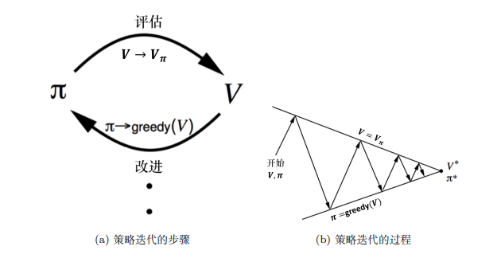

通过不断的进行评估和改进，我们就能不断逼近最优价值，同时也会得到贝尔曼最优方程：
$$
V_π(s) = \max_{a\in A} Q_π(s,a)
$$
贝尔曼最优方程表明：最佳策略下的一个状态的价值必须等于在这个状态下采取最好动作得到的回报的期 望。只有 当整个状态已经收敛后，我们得到最佳价值函数后，贝尔曼最优方程才会满足。
$$
Q_*(s,a) =R(s,a)+\gamma  \sum_{s^`\in S}P(s^`|s,a) \max_{a^`} Q_*(s^`,a^`)
$$

$$
V_π(s) =\max_{a}\left(R(s,a)+\gamma  \sum_{s^`\in S}P(s^`|s，a)V_π(s^`)\right)
$$

> [!CAUTION]
>
> 注意贝尔曼期望方程与贝尔曼最优方程的区别，前者是对所有可能的状态进行概率求和，而后者则是直接取最大的那个

**价值迭代**

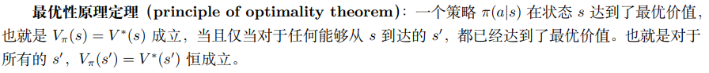

未来的最优值决定了当前的最优值，因此可以使用动态规划求解。

根据最优性原理，如果我们知道子问题 $V_*(s`)$ 的最优解，那么就可以通过价值迭代来得到最优的 $V_*(s)$ 的解。
$$
V_π(s) =\max_{a}\left(R(s,a)+\gamma  \sum_{s^`\in S}P(s^`,a|s)V_π(s^`)\right)
$$
尽管上述的贝尔曼最优方程只有当整个马尔可夫决策过程已经达到最佳的状态时才满足，但我们可以把它转换成一个备份的等式。**我们不停地迭代贝尔曼最优方程，价值函数就能逐渐趋向 于最佳的价值函数**，这是价值迭代算法的精髓。

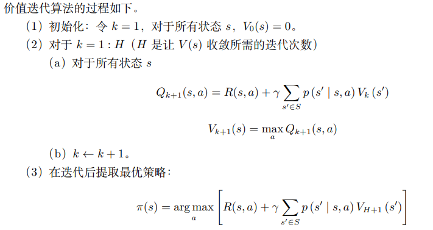

> [!IMPORTANT]
>
> 价值迭代与策略迭代之间的区别:
>
> 策略迭代：分两步，首先进行策略评估，即对当前已经搜索到的策略函数进行估值。得到估值后，我们进行策略改进， 即把 Q 函数算出来，进行进一步改进。不断重复这两步，直到策略收敛。
>
> 价值迭代：直接使用贝尔曼最优方程进行迭代，从而寻找最佳的价值函数。找到最佳价值函数后，我们再提取最佳策略(其实也是通过选择最大动作价值函数所代表的动作)。

**截断策略迭代**

在每次策略评估时，不进行完全的评估，而是通过**截断**（即有限次迭代）来近似策略评估。这种方式减少了每次策略评估所需的计算量。

从某种意义上来说，价值迭代可以看为单步更新状态价值的策略迭代方法，而策略迭代则进行了无穷次的状态价值更新。此时，截断策略迭代处于两者中间，进行有限次数的状态价值函数更新。在实际中，因为无法进行无穷次的状态价值更新，所以本质其实用的是截断策略迭代

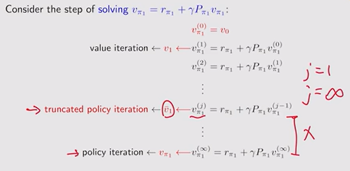

#### 2.5 总结

> [!IMPORTANT]
>
> 如何理解奖励R？
>
> 在马尔可夫奖励过程中R（s）代表s状态带来的下一时刻的即时奖励，在马尔可夫决策过程中R（s,a）代表s状态采取动作a带来的奖励。这两者从贝尔曼方程的角度考虑，其实都是下一时刻的即时奖励，不是在当前时刻，状态s的奖励。

> [!IMPORTANT]
>
> 为什么马尔可夫决策过程符合动态规划的前提和定义？
>
> 1. 承接上一个问题，正是由于R都是下一时刻的即时奖励，所以这符合最优子结构的定义
> 2. 是由于马尔可夫过程本身的定义：系统下一时刻的状态仅由当前时刻的状态决定，不依赖于以往任何状态。使得价值 V(s)可 分解为**即时奖励 + 未来状态的折扣价值**

### Chapter 3、免模型方法

> 状态转移概率是具有**马尔可夫性质**的（系统下一时刻的状态仅由当前时刻的状态决定，不依赖于以往任何状态）。

> [!IMPORTANT]
>
> 前面介绍了强化学习的智能体包括：策略，价值函数，模型（状态转移概率，奖励函数）。从定义来分：
>
> 1. 如果我们知道概率函数和奖励函数，马尔可夫决策过程就是已知的，我们可以通过策略迭代和价值迭代来找最佳的策略。也称为**有模型**
> 2. 如果环境是未知的，则称为**免模型**。当马尔可夫决策过程的模型未知或者模型很大时，我们可以使用免模型强化学习的方法。免模型强化学习方法没有获取环境的状态转移和奖励函数，而是让智能体与环境进行交互，采集大量的轨迹数据，智能体从轨迹中获取信息来改进策略，从而获得更多的奖励。

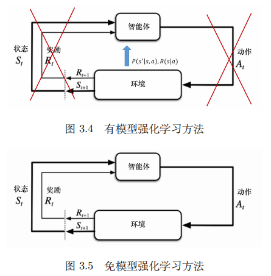

对于有模型方法，完全可以直接应用策略迭代和价值迭代来得到最优策略和最优价值函数（这两个方法对于最优性有理论保证），这两种方法都是动态规划的思想

#### 3.1蒙特卡洛方法（MCTS）

核心思想：基于状态价值函数的定义，从数据进行评估计算（learning from data）

> [!IMPORTANT]
>
> **Mean estimation**：均值估计
>
> 使用蒙特卡洛从经验样本进行学习的方法本质上是均值估计，即求取状态或动作价值函数的平均值
> $$
> E[X] = \sum_{x∈\mathcal{X}}p(x)x
> $$
> 当样本数量趋近于无穷时，样本均值收敛于总体均值的性质------**大数定理**。

**1、基础蒙特卡洛方法**

基于上述的数学性质，在免模型中我们可以将策略迭代方法转换为蒙特卡洛的形式，也被称为MC-Based algorithm

**回顾策略迭代方法**：

step1：策略评估

第一个公式是整个贝尔曼方程的矩阵表示形式，第二个是每个状态价值函数的具体计算方程
$$
V_{πk}= R_{πk}+\gamma P_{πk}V_{πk}
$$

$$
V_π(s)=\sum_{a\in A}π(a | s)\left(R(s,a)+\gamma  \sum_{s^`\in S}P(s^`|s,a)V_π(s^`) \right)=\sum_{a\in A}π(a | s)R(s,a)+\gamma\sum_{a\in A}π(a | s)  \sum_{s^`\in S}P(s^`|s,a)V_π(s^`) = R_{π}(s)+\gamma\sum_{s^`\in S}P_π(s^`|s)V_π(s^`)
$$

step2: 策略迭代

策略迭代的本质是contractive mapping（缩放映射）
$$
π_{k+1}= \arg\max_{π}(R_{πk}+\gamma P_{πk}V_{πk})
$$

$$
Q_π(s,a) =R(s,a)+\gamma  \sum_{s^`\in S}P(s^`|s,a)V_π(s^`)
$$

$$
π_{k+1}(a|s) = 
\begin{cases}
1,& if\ a=arg \max_{a\in A} Q_π(s,a) \\
0,& else
\end{cases}
$$

由于在免模型条件下，P和R都是未知的，所以无法直接使用贝尔曼方程进行策略评估，那如何求解 $Q_π(s,a)$ 呢？

很简单，从定义出发：
$$
Q_π(s,a)= E_π [G_t| s_t = s,a_t=a]
$$
因此，我们就需要采样大量的轨迹来逼近奖励期望，通过求解平均值就可以直接得到 $Q_π(s,a)$

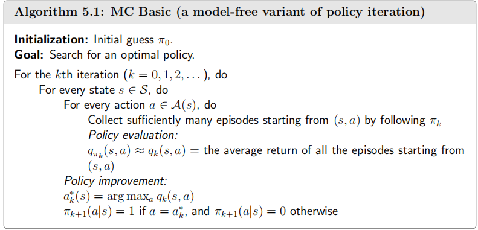

> [!IMPORTANT]
>
> 1、选取的episode length 对结果的影响 
>
> 距离目标较近的状态比距离目标较远的状态更早地拥有非零值。产生这种现象的原因如下：从一个状态出发，智能体必须至少走一定数量的步骤才能到达目标状态并获得正奖励。如果episode长度小于达到目标所需的最小步骤数，则可以确定回报为零，状态值估计也是零。在这个例子中，情节长度必须至少为 15，这是从左下角状态出发到达目标所需的最小步骤数。
>
> **稀疏奖励**（sparse reward）指的是除非达到目标，否则无法获得正奖励的情境。稀疏奖励设置要求情节较长，且能够到达目标。当状态空间较大时，这一要求很难满足。因此，稀疏奖励问题会降低学习效率。解决这个问题的一个简单技术是设计**非稀疏奖励**。例如，在上述网格世界的例子中，我们可以重新设计奖励设置，使得智能体在到达接近目标的状态时就能获得一个小的正奖励。

**2、MC Exploring Starts**

上述的基础MCTS方法存在一个很大的问题：数据利用效率太低。为了更新一个q（s,a）要进行多次的episode采样，并且每次采样的长轨迹数据只用来更新一个q（s,a）的策略。

给定一个基于策略 $π$ 采样的轨迹：
$$
s1 \overset{a1}{\rightarrow}  s2 \overset{a4}{\rightarrow} s1 \overset{a2}{\rightarrow} s2\overset{a3}{\rightarrow}s5
\overset{a1}{\rightarrow}. . .
$$
**Every time a state-action pair appears in an episode, it is called a *visit* of that state-action pair.**

**2.1、数据评估效率**

在上一节的基础MCTS算法中使用的是initial-visit strategy：一段轨迹仅用于估计其最开始的状态-动作对。可以发现，使用这些的策略使得该轨迹中的其它状态-动作对都被浪费掉了，导致经验数据的利用效率极低。考虑将原始的episode进行分解：

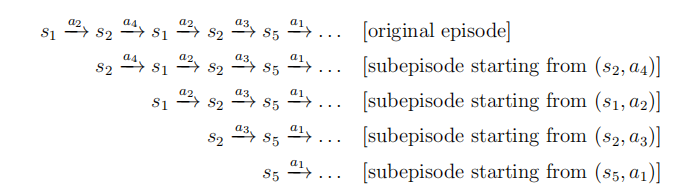

分解后的episode可以多次利用，用于对 $q(s_1,a_2),q(s_2,a_4),q(s_1,a_2),q(s_2,a_3),...$ 进行估计。因此，有了两种新的策略：

* first-visit：在整个轨迹中每个第一次出现的$q(s,a)$ 都用来进行估计 （**注意与initial-visit的区别**）
* every-visit：在整个轨迹中每个$q(s,a)$ 都用来进行估计 

**2.2、策略更新效率**

[1]: https://imzhanghao.com/2022/02/10/reinforcement-learning/
[2]: https://www.cnblogs.com/pinard/p/9426283.html

